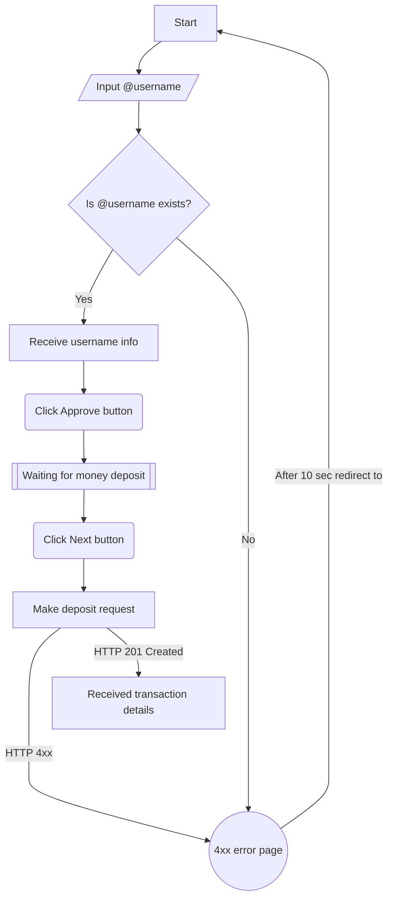

# Flow diagram

!!! success Tip
    
    For more information see [Mermaid.js](https://squidfunk.github.io/mkdocs-material/reference/diagrams/)
    

## Block descriptions

### start

The initial screen with the ability to enter username and click on the "Next" button

### input_username

The user enters username and clicks on the "Next" button

### retrieve_user

The terminal system sends a request to the iumiCash server at `GET /api/v1/users/<username:str>/`.

See [This link](/users/retrieve/) for more information about this request.

### username_exist

If Response from `GET /api/v1/users/<username:str>/` returned `200 OK`, terminal displays username details,
such as `first_name` and `last_name`. The terminal waits for one minute until the user clicks the "Next" button.

### error_page

# ToDo

If Response from `GET /api/v1/users/<username:str>/` returned `4xx Status Code`, terminal displays error details.
(`User Not Found`, `User is deactivated`, etc.) and returns user to the [start page](#start) after 10 seconds.

### username_approving

The client makes sure that the `first_name` and `last_name` matches the person whose username he entered and click the "Approve" button.

### waiting_for_deposit

The terminal waits for the user to enter money.

### next_after_money_deposit

After the client has entered a sufficient amount for Cash In, he clicks on the "Next" button.

### deposit_request

The client is shown the final information about the inserted data, total sum and commission.
Loading is also output to get the status and details of the transaction.
In parallel, the terminal system sends a CashIn request to the iumiCash backend.

### successful_deposit_request

# Todo
