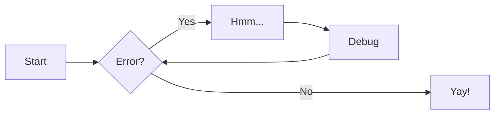

# Flow diagram

!!! success Tip
    
    For more information see [Mermaid.js](https://squidfunk.github.io/mkdocs-material/reference/diagrams/)
    

```mermaid
graph LR
  A[Start] --> B{Error?};
  B -->|Yes| C[Hmm...];
  C --> D[Debug];
  D --> B;
  B ---->|No| E[Yay!];
```
