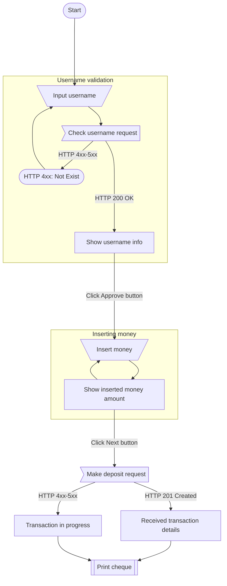

# Flow diagram

## Block descriptions

### start

The initial screen with the ability to enter username and click on the "Next" button

### input_username

The user enters username and clicks on the "Next" button

### check_username_request

The terminal system sends a request to the iumiCash server at `GET /api/v1/users/<username:str>/`.

See [This link](/users/retrieve/) for more information about this request.

### show_username_info

If Response from `GET /api/v1/users/<username:str>/` returned `200 OK`, terminal displays username details,
such as `first_name` and `last_name`. The terminal waits for one minute until the user clicks the "Next" button.

### error_page

This page displays any possible error. For example, if a response does not have `2xx Status code`.

If Response from `GET /api/v1/users/<username:str>/` returned `4xx Status Code`, terminal displays error details.
(`User Not Found`, `User is deactivated`, etc.) and returns user to the [start page](#start) after 10 seconds.

### insert_money

The terminal waits for the user to enter money.

### show_inserted_money_amount

The terminal shows inserted money amount.

### deposit_request

The client is shown the final information about the inserted data, total sum and commission.
Loading is also output to get the status and details of the transaction.
In parallel, the terminal system sends a CashIn request to the iumiCash backend.

See [cash in transaction](/transactions/cash_in/) for request details.

### successful_deposit_request

If transaction received, terminal displays transaction details.

### error_deposit_request

If transaction failed, terminal displays error details.

### print_cheque

Prints cheque using `cheque_content` from [successful deposit request](#successful_deposit_request).

For more details, see [Cheque generation](/cash_in/cheque_generation)
