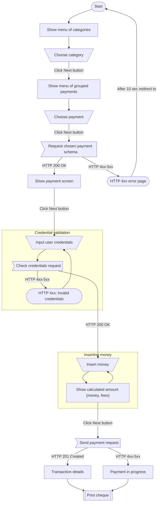

# Flow diagram

## Block descriptions

### start

The initial screen with all payment categories.

### show_categories

Each category is clickable and contains specific payments.

### choose_category

The user clicked on the category.

### show_grouped_payments

This screen displays only payments related to the selected category.

### choose_payment

The user clicked on the payment.

### payment_schema_request

The terminal system sends a request to the iumiCash server at `GET /v1/terminal-api/payments/schemas/<key>/`.

See [This link](get.md) for more information about this request.

### error_page

This page displays any possible error. For example, if a response does not have `2xx Status code`.

### show_payment_screen

Terminal renders payment screen based on the provided payment schema.

### input_user_credentials

User inputs payment credentials, such as `phone` if payment is Bmobile/Our Telekom, `login` if payment is Satsol etc.

### check_credentials_request

The terminal system sends a request to the iumiCash server at `POST /v1/terminal-api/payments/check-credentials`.

See [This link](../payments/check_credentials.md) for more information about this request.

### insert_money

Terminal is waiting for inserting user money. Trigger to stop waiting is press "Next" button.

### calculate_amount_and_fees

Since the terminal system knows the policy of calculating all payment fees ([Fees policies](../fees/policies.md)), 
the terminal can display a list of fees every time a banknote is entered.

### send_payment_request

The terminal system sends a request to the iumiCash server at `POST /v1/terminal-api/transactions/payments/`.

See [This link](../transactions/send_payment.md) for more information about this request.

### successful_send_payment_request

If iumiCash responded with `201 Created` request and the transaction status is `Success` (See [*All Transaction Statuses*](../transactions/statuses.md)), 
then the terminal shows the details of the successfully 
completed transaction and proceeds to print the receipt

### error_send_payment_request

If for some reason the iumiCash server did not respond or returned the status not `Success`, 
the terminal must show the details of the transaction and print a receipt, 
according to which the user will be able to refund the money for the unsuccessful transaction 
(More about this: [Cheque refund](../payments/cheque_generation.md#cheque-refund)). At this time, the terminal system should send a request to the 
iumiCash server until it is convinced of the finiteness of the transaction.

!!! note
    Please, pay attention to [idempotency](../idempotency.md), while terminal system is sending the request.

### print_cheque

Prints cheque using `cheque_content` from [successful_send_payment_request](#successful_send_payment_request).

For more details, see [Cheque generation](../payments/cheque_generation.md)
